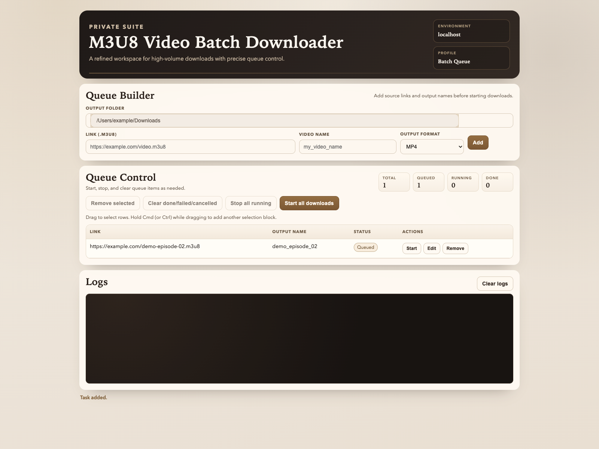

# M3U8 Video Batch Downloader (Local)

Batch download `.m3u8` links with `yt-dlp` using either:
- a localhost web UI (`yt_dlp_web.py`)
- a desktop Tkinter app (`yt_dlp_batch_gui.py`)

## UI Preview



## Features

- Queue multiple links with custom output names
- Run multiple downloads in parallel
- Choose output format (`mp4`, `mkv`, `webm`, `mov`, or `original`)
- Start/stop individual queue items from the web UI
- View live per-task download progress in the queue
- Edit/remove queued items
- Stop running tasks
- Stream live logs
- Optional container remux to selected format when supported
- Auto-retry with browser cookies when YouTube asks to sign in (bot check, age gate, private/members-only videos)

## Requirements

- macOS
- Python 3
- `yt-dlp`
- `ffmpeg` (required by `yt-dlp` for merging/remuxing)

Install dependencies (Homebrew):

```bash
brew install yt-dlp ffmpeg
```

## Quick start (web UI)

From this project folder:

```bash
python3 yt_dlp_web.py --open-browser
```

Open:

```text
http://127.0.0.1:8765
```

## Quick start (desktop UI)

```bash
python3 yt_dlp_batch_gui.py
```

## Usage

1. Set output folder (default is `~/Downloads`).
2. Add `Link (.m3u8)` and `Video name`.
3. Choose `Output format`.
4. Use row actions to start, stop, edit, or remove individual tasks when needed.
5. Click `Start all downloads` to run all queued downloads.

Equivalent command per task:

```bash
yt-dlp "LINK" -o "VIDEO_NAME.%(ext)s" --merge-output-format FORMAT --remux-video FORMAT
```

## YouTube sign-in / cookies

Some YouTube links fail with `Sign in to confirm you're not a bot` (or are age-gated / members-only). When the web UI detects this, it automatically retries the download with `--cookies-from-browser`, walking through installed browsers in order: Chrome, Brave, Edge, Firefox, Safari.

- Be signed in to YouTube in one of those browsers for the retry to work.
- On macOS, reading Chrome/Brave/Edge cookies can trigger a one-time keychain prompt — click "Allow".
- Reading Safari cookies may require granting your terminal Full Disk Access.

## Privacy and safety notes

- The web server binds to `127.0.0.1` by default (local machine only).
- Do not use `--host 0.0.0.0` unless you intentionally want network access.
- The README preview image uses generic demo links and a sanitized output-folder field.
- Before publishing, keep local artifacts out of git (`.playwright-cli/`, `__pycache__/`, `*.pyc`).
